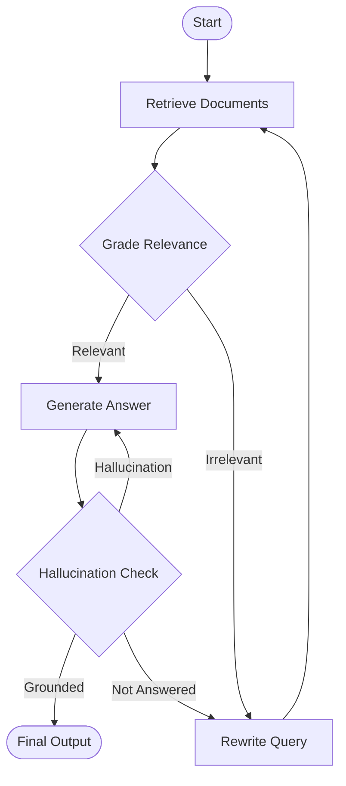

# tiny-rag-agent

A lightweight, agentic Retrieval-Augmented Generation (RAG) system built for technical documentation analysis. This project implements a "Self-Reflective" workflow using LangGraph, combining hybrid search strategies with iterative reasoning to reduce hallucinations.

The environment and dependency management infrastructure is adapted from [tiny-llm](https://github.com/skyzh/tiny-llm).

## System Architecture

The core logic is a state machine that critiques its own retrieval and generation quality before finalizing an answer.



## Key Features

* **Hybrid Search**: Implements an ensemble retriever combining BM25 (keyword) and ChromaDB (semantic) to improve recall on technical terms.
* **Agentic Control Flow**: Uses LangGraph to implement cyclical reasoning (Retrieve -> Grade -> Generate -> Reflect).
* **Local-First Design**: Optimized for running on Apple Silicon using MLX (via the tiny-llm foundation) or efficient API bridging.
* **Structured Output**: Enforces strict schema adherence for document citations and relevance scoring.

## Environment Setup

This project uses `pdm` for dependency management and requires a Macintosh device with Apple Silicon (M1/M2/M3) for local inference optimizations, following the [tiny-llm](https://github.com/skyzh/tiny-llm) setup guide.

### Prerequisites

1. **Install pdm**: Follow the [official guide](https://www.google.com/search?q=https://pdm-project.org/en/latest/%23installation) to install pdm.
2. **Hugging Face CLI**: Required for downloading model weights.

### Installation

Clone the repository and install dependencies. PDM will automatically create a virtual environment.

```bash
git clone [https://github.com/Hzsen/tiny-rag-agent](https://github.com/Hzsen/tiny-rag-agent)
cd tiny-rag-agent
pdm install -v

```

### Verify Installation

Run the installation check to ensure the environment and dependencies are correctly configured.

```bash
pdm run check-installation

```

### Model Preparation (Qwen2 / DeepSeek)

We use Qwen2-Instruct or DeepSeek models for inference. If running locally via MLX, download the weights using `huggingface-cli`.

**Note:** The 7B model requires approximately 20GB of memory. Use the 0.5B model for testing on devices with lower RAM.

```bash
huggingface-cli login

# For low memory environments
huggingface-cli download Qwen/Qwen2-0.5B-Instruct-MLX

# Recommended for better reasoning
huggingface-cli download Qwen/Qwen2-7B-Instruct-MLX

```

## Usage

### Configuration

Copy the example environment file and configure your API keys (if using cloud fallbacks) or local model paths.

```bash
cp .env.example .env

```

### Running the Agent

To start the RAG pipeline with the default settings:

```bash
pdm run main --mode local

```

To run with OpenAI (cloud mode):

```bash
OPENAI_API_KEY=... pdm run main --mode cloud

```

To run with DeepSeek (OpenAI-compatible API):

```bash
DEEPSEEK_API_KEY=... pdm run main --mode deepseek

```

DeepSeek environment variables:

- `DEEPSEEK_API_KEY`: required
- `DEEPSEEK_MODEL`: optional, default `deepseek-chat`
- `DEEPSEEK_BASE_URL`: optional, default `https://api.deepseek.com`

## Walkthrough (File + Function Guide)

This section explains each module and function in the tiny-rag-agent codebase.
If you are new to RAG, read this in order: ingestion -> retrieval -> graph -> CLI.

### Project Layout (What lives where)

- `src/tiny_rag_agent/`: Core RAG application code.
- `scripts/`: Helper utilities (environment checks, ingestion test).
- `src/extensions/` + `src/tiny_llm/`: Upstream MLX/LLM utilities from `tiny-llm`.
  These are used for local inference experiments but are not required for the
  default CLI workflow shown below.

### `src/tiny_rag_agent/cli/main.py` (CLI entrypoint)

- `LocalHeuristicChatModel`:

  -  Minimal `BaseChatModel` implementation for local, no-dependency runs.
  -  Lets the workflow run without a real LLM so the rest of the pipeline can be tested.
  -  Returns deterministic "yes" decisions and a simple answer based on prompt text.
- `LocalHeuristicChatModel._llm_type()`:

  -  Declares the model type string.
  -  Required by LangChain `BaseChatModel`.
  -  Returns `"local-heuristic"`.
- `LocalHeuristicChatModel._generate(...)`:

  -  Produces a chat response from input messages.
  -  Core method used by LangChain to generate text.
  -  Calls `_heuristic_response()` and wraps it as an `AIMessage`.
- `LocalHeuristicChatModel.with_structured_output(...)`:

  -  Creates a runnable that returns structured outputs for evaluators.
  -  Graph nodes use JSON schemas for grading and rewrites.
  -  For Pydantic schemas, returns defaults like `score="yes"`.
- `CloudChatModel`:

  -  OpenAI-backed chat model wrapper with JSON-mode support.
  -  Enables real LLM inference for grading/rewrite/generation.
  -  Uses `openai` client and `response_format={"type": "json_object"}`.
- `CloudChatModel._llm_type()`:

  -  Declares the model type string.
  -  Required by LangChain `BaseChatModel`.
  -  Returns `"openai"`.
- `CloudChatModel._generate(...)`:

  -  Generates text from messages using OpenAI.
  -  Primary LLM call for chat completions.
  -  Calls `_call_openai()` and wraps the content in an `AIMessage`.
- `CloudChatModel.with_structured_output(...)`:

  -  Produces a runnable that returns structured JSON outputs.
  -  Graders expect strict JSON to validate with Pydantic.
  -  Builds a schema prompt, asks the model in JSON mode, parses to model.
- `CloudChatModel._call_openai(...)`:

  -  Low-level call to OpenAI chat completions.
  -  Centralizes request/response formatting.
  -  Maps LangChain messages to OpenAI format and strips output text.
- `DeepseekChatModel`:

  -  DeepSeek chat model using an OpenAI-compatible API.
  -  Adds a cloud option without changing the rest of the pipeline.
  -  Uses `DEEPSEEK_API_KEY` and `DEEPSEEK_BASE_URL` for authentication.
- `DeepseekChatModel._llm_type()`:

  -  Declares the model type string.
  -  Required by LangChain `BaseChatModel`.
  -  Returns `"deepseek"`.
- `DeepseekChatModel._generate(...)`:

  -  Generates text from messages using DeepSeek.
  -  Primary LLM call for chat completions in DeepSeek mode.
  -  Calls `_call_deepseek()` and wraps the content in an `AIMessage`.
- `DeepseekChatModel.with_structured_output(...)`:

  -  Produces a runnable that returns structured JSON outputs.
  -  Graders expect strict JSON to validate with Pydantic.
  -  Builds a schema prompt, asks the model in JSON mode, parses to model.
- `DeepseekChatModel._call_deepseek(...)`:

  -  Low-level call to DeepSeek chat completions.
  -  Centralizes request/response formatting.
  -  Maps LangChain messages to OpenAI format and strips output text.
- `_heuristic_response(...)`:

  -  Deterministic response generator for local mode.
  -  Keeps the graph moving without a real LLM.
  -  Detects patterns in prompts (rewrite, grading, generate).
- `_build_generate_chain(...)`:

  -  Builds a simple LCEL generation chain.
  -  The `generate` node needs a runnable to produce answers.
  -  Uses a prompt template + LLM + `StrOutputParser()`.
- `_load_chunks(...)`:

  -  Runs ingestion on a file path and returns chunks.
  -  CLI uses this before retrieval to index documents.
  -  Instantiates `Chunker` with default `IngestionConfig`.
- `_parse_args(...)`:

  -  CLI argument parser.
  -  Supports `--mode`, `--file`, `--query`, and `--force`.
  -  Uses `argparse.ArgumentParser` and returns `Namespace`.
- `_prompt_for_query()`:

  -  Interactive query prompt.
  -  CLI can be run without `--query`.
  -  `input()` + validation for empty strings.
- `_message_to_openai(...)`:

  -  Converts LangChain `BaseMessage` to OpenAI format.
  -  OpenAI API expects `{role, content}` dicts.
  -  Maps message classes to roles (`system/user/assistant`).
- `_normalize_messages(...)`:

  -  Accepts various input types and returns a list of messages.
  -  Used by structured output to handle multiple input shapes.
  -  Handles lists, single messages, strings, and dicts with `"messages"`.
- `_schema_prompt(...)`:

  -  Builds a "return JSON with fields" prompt.
  -  Helps enforce strict JSON output from the LLM.
  -  Reads fields from Pydantic models or dict schemas.
- `_vector_store_exists(...)`:

  -  Checks if a Chroma directory has any files.
  -  Skips re-ingestion unless `--force`.
  -  Checks directory existence and `iterdir()`.
- `_print_event(...)`:

  -  Pretty-prints LangGraph streaming events.
  -  Gives the user visibility into each node output.
  -  Prints counts or fields based on node name.
- `main(...)`:

  -  CLI entrypoint for the workflow.
  -  Wires ingestion, retrieval, LLM, and the graph together.
  -  Loads settings, ingests optional file, builds retriever, runs graph.

### `src/tiny_rag_agent/config/settings.py` (Environment configuration)

- `Settings`:

  -  Pydantic settings container for required paths.
  -  Centralizes configuration for models and storage.
  -  Reads values from environment variables in `from_env()`.
- `Settings.from_env(...)`:

  -  Factory to load settings from environment + `.env`.
  -  Keeps CLI/graph setup consistent.
  -  Uses `python-dotenv` and `_require_env()`.
- `_require_env(...)`:

  -  Fetches a required env var.
  -  Fails early with a clear error.
  -  Raises `ValueError` if missing.

### `src/tiny_rag_agent/graph/state.py` (Graph state schema)

- `GraphState`:

  -  Pydantic state passed between LangGraph nodes.
  -  Ensures structured, typed data flow.
  -  Holds `query`, `docs`, `scores`, `answer`, `hallucination_grade`.

### `src/tiny_rag_agent/graph/chains.py` (LLM chains)

- `Grade`:

  -  Pydantic output model for relevance grading.
  -  Forces strict "yes/no" output for filters.
  -  `score` is a literal `"yes" | "no"`.
- `HallucinationGrade`:

  -  Pydantic output model for grounding checks.
  -  Standardizes grounded vs hallucinated decisions.
  -  `score` is `"yes" | "no"`.
- `AnswerGrade`:

  -  Pydantic output model for answer quality.
  -  Optional evaluator for "does it answer the question".
  -  `score` is `"yes" | "no"`.
- `grader_chain(...)`:

  -  Builds an LCEL chain that grades document relevance.
  -  Filters out irrelevant chunks before generation.
  -  Prompt -> `llm.with_structured_output(Grade)`.
- `rewrite_chain(...)`:

  -  Builds a chain that rewrites a query for retrieval.
  -  Improves vector/keyword recall on hard questions.
  -  Prompt -> LLM -> `StrOutputParser()`.
- `hallucination_grader_chain(...)`:

  -  Builds a chain to check grounding vs docs.
  -  Prevents hallucinated answers from exiting the graph.
  -  Prompt -> `llm.with_structured_output(HallucinationGrade)`.
- `answer_grader_chain(...)`:

  -  Builds a chain to check if answer addresses the question.
  -  Optional quality gate for final responses.
  -  Prompt -> `llm.with_structured_output(AnswerGrade)`.

### `src/tiny_rag_agent/graph/nodes.py` (Graph nodes)

- `_format_documents(...)`:

  -  Concatenates document chunks into a single string.
  -  Prompts expect a combined "Documents" section.
  -  Joins `chunk.text` with double newlines.
- `HallucinationGrade`:

  -  Node-level schema that includes explanation text.
  -  Keeps grounding checks transparent for debugging.
  -  Includes `score` and `explanation`.
- `retrieve(...)`:

  -  Retrieves candidate chunks for the current query.
  -  First step in RAG; provides grounding context.
  -  Uses `HybridRetriever.search()` and returns `docs`.
- `grade_documents(...)`:

  -  Filters chunks with a relevance grader.
  -  Removes noisy chunks before generation.
  -  Runs `grader_chain` on each chunk and keeps `"yes"` docs.
- `transform_query(...)`:

  -  Rewrites the query to improve retrieval.
  -  Helps when initial retrieval is empty or weak.
  -  Uses `rewrite_chain` to generate a new query string.
- `generate(...)`:

  -  Generates an answer grounded in documents.
  -  Produces the user-facing response.
  -  Runs `generate_chain` with question + formatted docs.
- `check_hallucination(...)`:

  -  Verifies if the answer is grounded in the docs.
  -  Prevents hallucinated answers from ending the flow.
  -  Uses a strict grounding prompt with structured output.

### `src/tiny_rag_agent/graph/workflow.py` (Graph wiring)

- `build_workflow(...)`:

  -  Builds and compiles the LangGraph state machine.
  -  Connects retrieval, grading, generation, and checks.
  -  Adds nodes + edges, then conditional routes after grading/checking.

### `src/tiny_rag_agent/ingestion/schema.py` (Ingestion schemas)

- `IngestionConfig`:

  -  Chunk size/overlap configuration model.
  -  Centralizes ingestion parameters for chunking.
  -  Uses Pydantic fields with defaults.
- `DocumentChunk`:

  -  Canonical schema for a single chunk.
  -  Shared structure across ingestion, retrieval, and graph.
  -  Stores ids, source, page, text, metadata.

### `src/tiny_rag_agent/ingestion/loader.py` (Loaders)

- `BaseLoader`:

  -  Abstract loader interface.
  -  Keeps PDF/Markdown loaders interchangeable.
  -  Requires a `load()` generator method.
- `PDFLoader.load(...)`:

  -  Extracts text per PDF page.
  -  Preserves page metadata for citations.
  -  Uses `pypdf.PdfReader` and `_clean_pdf_text()`.
- `MarkdownLoader.load(...)`:

  -  Reads a Markdown file as one text block.
  -  Markdown is usually short and structured already.
  -  Reads file -> `_normalize_whitespace()`.
- `load_file(...)`:

  -  Chooses the right loader by file extension.
  -  Simplifies ingestion API for the caller.
  -  `.pdf` -> `PDFLoader`, `.md` -> `MarkdownLoader`.
- `_clean_pdf_text(...)`:

  -  Removes PDF artifacts (page numbers, extra whitespace).
  -  Cleaner text improves chunking and retrieval.
  -  Filters lines and removes "page N" style noise.
- `_normalize_whitespace(...)`:

  -  Collapses extra whitespace while keeping newlines.
  -  Standardizes input for chunking.
  -  Regex replaces repeated spaces/newlines.

### `src/tiny_rag_agent/ingestion/chunker.py` (Chunking)

- `Chunker.__init__(...)`:

  -  Stores chunk size/overlap from config.
  -  Makes chunking behavior configurable.
  -  Saves `chunk_size` and `chunk_overlap`.
- `Chunker.chunk(...)`:

  -  Splits a text into retrieval-friendly chunks.
  -  Keeps context windows small and consistent.
  -  Recursive splitting + overlap merge.
- `Chunker.process_document(...)`:

  -  Convenience wrapper for `process_file(...)`.
  -  Keeps ingestion API simple.
  -  Calls `process_file(...)` with default loader.
- `Chunker.process_file(...)`:

  -  Loads a file and converts it to `DocumentChunk` objects.
  -  Central entry point for ingestion.
  -  Uses loader, chunker, and `_stable_doc_id(...)`.
- `Chunker._recursive_split(...)`:

  -  Splits text by paragraph, line, then word.
  -  Keeps chunks semantically coherent.
  -  Recurses through separator list until size fits.
- `Chunker._split_by_size(...)`:

  -  Fixed-size splitting fallback.
  -  Handles very long sections without separators.
  -  Sliding window with overlap.
- `Chunker._merge_with_overlap(...)`:

  -  Builds final chunks with configured overlap.
  -  Preserves context across chunk boundaries.
  -  Combines splits and carries overlap tail forward.
- `_stable_doc_id(...)`:

  -  Generates a stable hash for a document path.
  -  Keeps chunk IDs consistent across runs.
  -  SHA-256 of the file path.

### `src/tiny_rag_agent/retrieval/vector_store.py` (Vector store)

- `_EmbeddingConfig`:

  -  Lightweight config for embeddings.
  -  Keeps embedding params in one place.
  -  Dataclass with model name and dimensions.
- `_SimpleEmbeddingFunction`:

  -  Deterministic hashed bag-of-words embedding.
  -  Fallback when no model is available.
  -  Hashes tokens into buckets and normalizes.
- `_SimpleEmbeddingFunction.__call__(...)`:

  -  Converts texts into vectors.
  -  Required by ChromaDB embedding API.
  -  Tokenize -> hash -> normalize.
- `VectorStore.__init__(...)`:

  -  Initializes Chroma client and collection.
  -  Sets up vector storage on disk.
  -  Creates `PersistentClient` and collection.
- `VectorStore._init_client(...)`:

  -  Import-guarded Chroma client creation.
  -  Provides clear error if dependency missing.
  -  Raises ImportError with install guidance.
- `VectorStore._build_embedding_function(...)`:

  -  Chooses a real or fallback embedding.
  -  Makes the project runnable without heavy models.
  -  Tries `SentenceTransformerEmbeddingFunction`, falls back.
- `VectorStore.add_documents(...)`:

  -  Adds chunks + metadata to Chroma.
  -  Enables semantic retrieval.
  -  Stores ids, text, and metadata (JSON when needed).
- `VectorStore.query(...)`:

  -  Queries Chroma for top-k similar chunks.
  -  Provides semantic retrieval results.
  -  Queries by text then rebuilds `DocumentChunk` objects.

### `src/tiny_rag_agent/retrieval/keyword_store.py` (BM25)

- `KeywordStore.__init__(...)`:

  -  Initializes storage and BM25 index.
  -  Prepares for keyword retrieval.
  -  Stores chunks and a `BM25Okapi` instance.
- `KeywordStore._tokenize(...)`:

  -  Simple whitespace tokenizer.
  -  BM25 needs tokenized documents.
  -  Lowercase + `split()`.
- `KeywordStore.add_documents(...)`:

  -  Adds chunks and rebuilds the BM25 index.
  -  Keeps keyword search in sync with data.
  -  Builds tokenized corpus and initializes `BM25Okapi`.
- `KeywordStore.query(...)`:

  -  Returns top-k chunks by BM25 score.
  -  Provides keyword-based recall for exact terms.
  -  Scores all docs then ranks by score.

### `src/tiny_rag_agent/retrieval/hybrid.py` (Hybrid retriever)

- `HybridRetriever.__init__(...)`:

  -  Combines vector and keyword stores.
  -  Hybrid retrieval improves recall/precision.
  -  Accepts injected stores or creates defaults.
- `HybridRetriever.add_documents(...)`:

  -  Adds chunks to both stores.
  -  Keeps keyword/vector indexes in sync.
  -  Calls `VectorStore.add_documents()` and `KeywordStore.add_documents()`.
- `HybridRetriever.search(...)`:

  -  Merges vector and keyword results using RRF.
  -  Reciprocal Rank Fusion balances both retrievers.
  -  Scores results by rank and returns top-k.

### `scripts/check_env.py` (Environment checker)

- `ImportCheckResult`:

  -  Dataclass for a single import check result.
  -  Standardizes reporting for the CLI script.
  -  Stores module name, success, and error.
- `read_dependencies(...)`:

  -  Reads dependencies from `pyproject.toml`.
  -  Ensures checks match declared dependencies.
  -  Parses TOML and returns the list.
- `check_import(...)`:

  -  Tries to import a module.
  -  Verifies environment is correctly installed.
  -  Wraps `__import__` and captures errors.
- `main()`:

  -  Runs the import checks for all core deps.
  -  Provides a simple "is my env ready?" check.
  -  Loads dependencies, maps to import names, prints results.

### `scripts/test_ingestion.py` (Ingestion smoke test)

- `_has_number_dense_text(...)`:

  -  Flags text chunks with many digits.
  -  Tables often become hard to read; this warns about them.
  -  Computes digit ratio vs text length.
- `main()`:

  -  Runs a basic ingestion pass on a sample PDF.
  -  Validates loader + chunker behavior.
  -  Loads a PDF, prints sample chunks, warns on tables.

### `pyproject.toml` (Project metadata)

- `[tool.pdm.scripts]`:
  - `check-installation`: Runs `scripts/check_env.py`.
  - `main`: Runs the CLI at `tiny_rag_agent.cli.main`.

## Roadmap

| Component | Status | Description |
| --- | --- | --- |
| **Ingestion** | ✅ | PDF/Markdown loading and chunking |
| **Retrieval** | ✅ | Hybrid Search (BM25 + Vector) |
| **Graph Logic** | ✅ | Basic Re-ranking and Hallucination checks |
| **Serving** | 🚧 | FastAPI integration for external calls |
| **Eval** | 🚧 | RAGAS evaluation pipeline |

## License

MIT